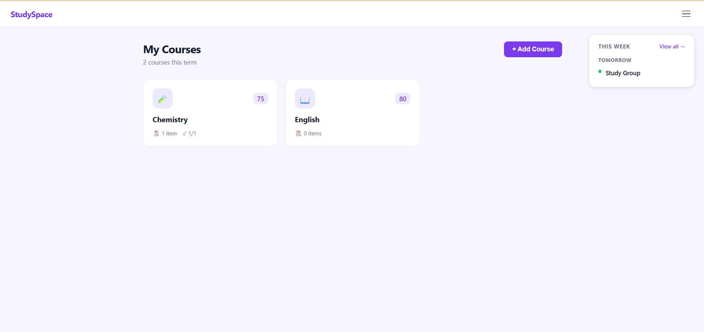
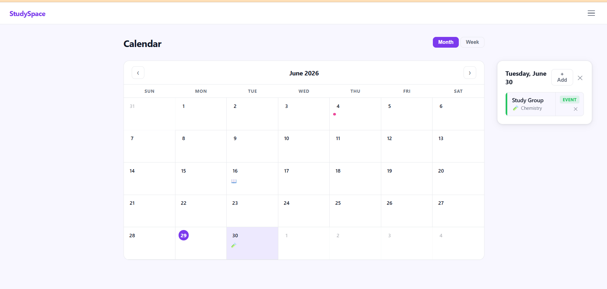
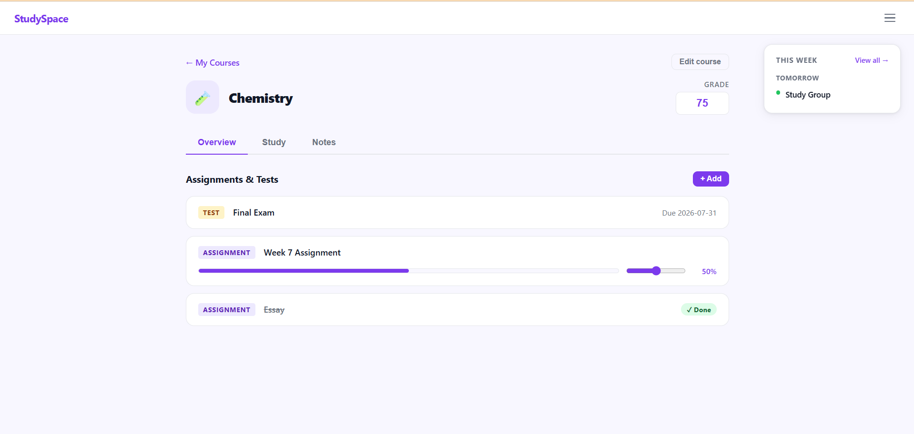

# StudySpace
StudySpace is an app where you can keep track of assignments, take notes, and log study sessions. 
## Features
- Track assignments and tests for each of your courses
- Use the calendar to track upcoming events and due dates
- Log your study sessions 
- Use flashcards and quizzes to study
- Take notes for each of your courses
- Track your grade for each course
## Screenshots

## Tech Stack
- Python + Flask (backend)
- HTML, CSS, JavaScript (frontend)
- JSON (data storage)
## How to Run
1. Clone this repo
2. Install dependencies: `pip install flask`
3. Run the app: `python app.py`
4. Open your browser to `http://localhost:5000`